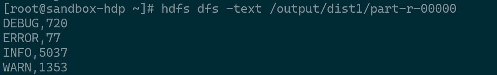
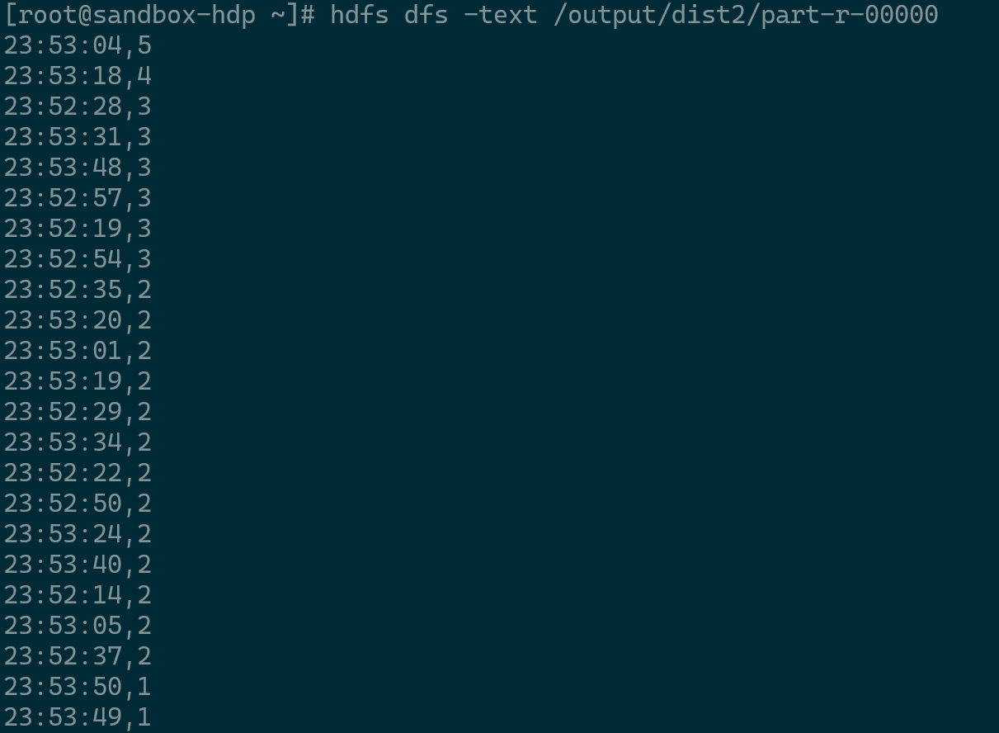
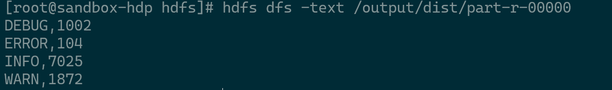
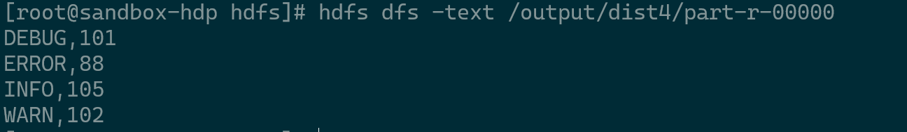

## Home Work 2 CS441

#### Vivek Mishra

#### University of Illinois at Chicago

### Introduction
The goal is to create a map/reduce program for parallel distributed processing of the log file.
The Demo video can be seen from the link below :-

[EMR Deployment Demo]("https://youtu.be/UhiAdQ4ZjjA") 


### Functionality
To create a program for parallel distributed processing of logs. The program can be 
broken into 4 tasks.

###### Task 1
To compute distribution of different types of messages across predefined 
time intervals and injected string instances of the designated regex
pattern for these log message types. 
The time interval and regEx is read from the application.conf file.

Class responsible for this task :- TimeIntervalLogs
###### Task 2
To compute time intervals sorted in the descending order that contained most 
log messages of the type ERROR with injected regex pattern string instances.
For our ease of understanding the time interval in this HW is 1 second.
The regEx is read from the application.conf file.


Class responsible for this task :- MostErrorInTime
###### Task 3
For each message type produce the number of the generated log messages.
A partitioner class is used to partition the output from mapper.
The number of reducer is taken from the application.conf file.

Class responsible for this task :- DistributionPattern
###### Task 4
To compute the number of characters in each log message for each type that 
contain the highest number of characters in the detected instances of the 
designated regex pattern. The regEx is read from the application.conf file.

Class responsible for this task :- LargestMessage

###### API Documentation
The documentation for all the classes and methods can be found in the link below:-


[API Documentation](https://vivek721.github.io/LogDistributionHadoop/)

### Installation instructions

This section contains the instructions on how to run the map/reduce 
implementation as part of this assignment,

##### Requirements:
scala 3.0.2, 
java sdk >= 8,
sbt-assembly 1.1.0,
hadoop-core 1.2.1,
IntelliJ IDEA,
VMWare,
Hortonworks Sandbox VM

###### Steps to get started

1. Download the code:
    ```
    > git clone git@github.com:vivek721/LogDistributionHadoop.git
    ```

2. Move to project path and run the below command 
    ```
   > sbt clean compile assembly
    ```
   sbt assembly should have assembly.sbt inside the project folder
   (file should be in the same level as build.properties) and
    build.sbt in the root folder configured. Assembly will create a 
    fat jar file in the location: target/scala-3.0.2/ with all the required dependencies.

3. Copy the jar and the log file 
    ```
    > scp -P 2222 {projectDir}/Data/logFile.txt root@{IP of Sandbox}:/home/hdfs/.
    > scp -P 2222 {projectDir}/target/scala-3.0.2/DistributionPatternHadoop-assembly-0.1.jar root@{IP of Sandbox}:/home/hdfs/.
   ```

4. Create a hdfs directory and output directory and copy logfile to data directory
    ```
    > su hdfs
    > cd /home/hdfs
    > hdfs dfs -mkdir /data
    > hdfs dfs -mkdir /output
    > hdfs dfs -copyFromLocal logFile.txt /data/.
   ```

5. To execute the jar file, as input arguments change depending on which program we are running
    ```
    task 1> hadoop jar DistributionPatternHadoop-assembly-0.1.jar /data/logFile.txt /output/dist1 1
   
    task 2> hadoop jar DistributionPatternHadoop-assembly-0.1.jar /data/logFile.txt /output/dist2Inter /output/dist2 2
   
    task 3> hadoop jar DistributionPatternHadoop-assembly-0.1.jar /data/logFile.txt /output/dist3 3
  
    task 4> hadoop jar DistributionPatternHadoop-assembly-0.1.jar /data/logFile.txt /output/dist4 4
   ```

6. To see the output of the task please use the below command
    ```
    > hdfs dfs -text /output/dist{1,2,3,4 (depending in task)}/part-r-00000
    ```

7. Sample output for
    ###### task 1
   

   ###### task 2
   

   ###### task 3
   

   ###### task 4
   
